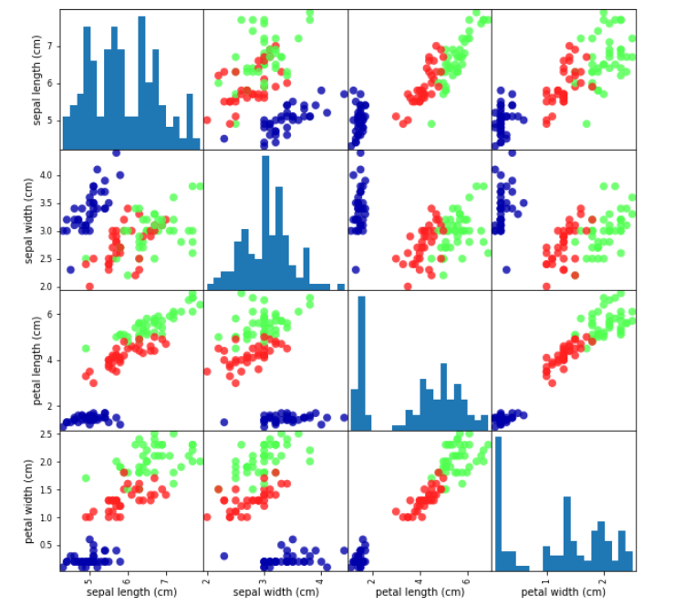

#  :cherry_blossom: Classifying Iris Species using k-Nearest Neighbors Classification Algorithm

Iris is a genus of 260–300 species of flowering plants with showy flowers. Each species of iris plant has its own classifying characteristics. In this project, we build a model in order to classify three iris species which are setosa, versicolor, and virginica on the basis on its sepal length, sepal width, petal length and petal width. The algorithm we used here is k-Nearest Classification Algorithm. 

## Installation

We implemented the project using the ML libraries of python3. So installation of python need to be done. Install python.
```bash
  https://www.python.org/downloads/
```
Any type of IDE would work for running this project. But we recommend to use jupyter notebook and for that we suggest to use miniconda.

According to your OS, download and install miniconda from here:
```bash
  https://docs.conda.io/en/latest/miniconda.html
```
Via Anaconda prompt, install:

Scikit-learn:
```
  conda install sk-learn
```
Pandas:
```
  conda install pandas
```
Matplotlib:
```
  conda install matplotlib
```
Mglearn:
```
  conda install mglearn
```
These are required Python ML libraries we need to install.
    
## :magnet: Demo

Here is the pair plot of the dataset:



Example of implementation:
```
# Making Predictions
# Suppose we get an iris with:
# sepal length = 5cm
# sepal width = 2.9 cm
# petal length = 1 cm
# petal width = 0.2 cm

import numpy as np

X_new = np.array([[5,2.9,1,0.2]]) # 2-dimensional array
print("X_new.shape: {}".format(X_new.shape))

prediction = knn.predict(X_new)

print("Prediction: {}".format(prediction))
print("Predicted target name: {}".format(iris_dataset['target_names'][prediction]))
```
As the ouput we get:

**X_new.shape: (1, 4)**

**Prediction: [0]**

**Predicted target name: ['setosa']**
## :clipboard: FAQ

#### Where do we get the dataset?

The dataset is in the scikit-learn library. We don't need any other CSV files.

#### Any reference books?

*Introduction to Machine Learning with Python: A guide for Data Scientist* by Andreas C. Müller & Sarah Guido

 
## :trophy: Acknowledgements

 - [Introduction to Machine Learning with Python: A guide for Data Scientist](https://www.oreilly.com/library/view/introduction-to-machine/9781449369880/)
 - [Hands-On Machine Learning with Scikit-Learn, Keras, and TensorFlow: Concepts, Tools, and Techniques to Build Intelligent Systems](https://www.amazon.com/Hands-Machine-Learning-Scikit-Learn-TensorFlow/dp/1492032646/ref=pd_lpo_14_t_0/141-7952228-5038400?_encoding=UTF8&pd_rd_i=1492032646&pd_rd_r=30f50b6e-e2a9-4168-825b-2d40581e3ce6&pd_rd_w=fawqF&pd_rd_wg=gEFlD&pf_rd_p=fb1e266d-b690-4b4f-b71c-bd35e5395976&pf_rd_r=4ETXQN6GG5BKM377KW2S&psc=1&refRID=4ETXQN6GG5BKM377KW2S)


  
